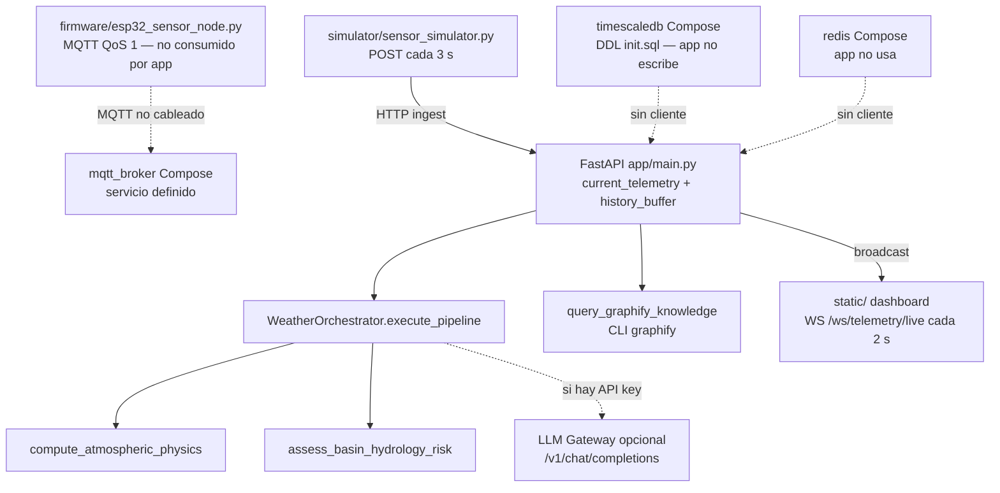
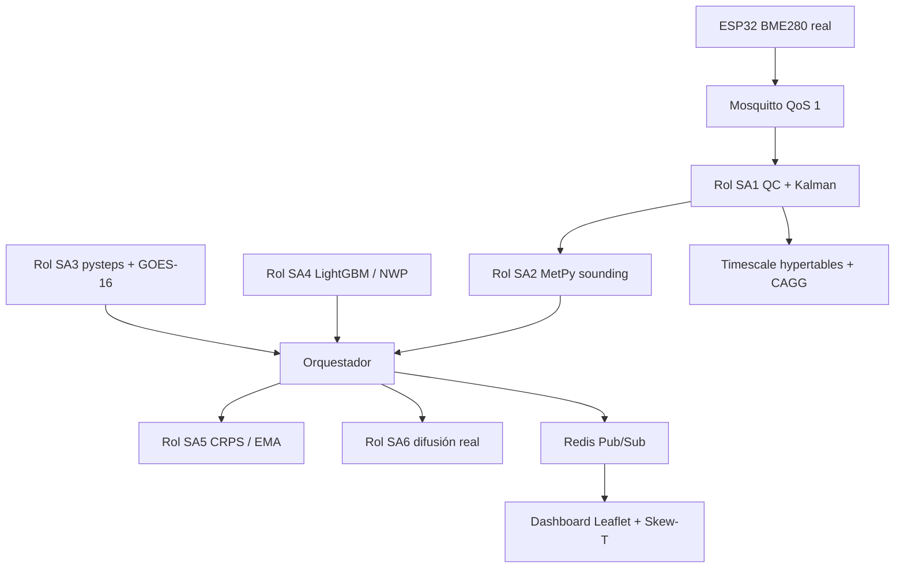

# Software Design Document (SDD)

Documento de diseño: *IvekBot Weather Station*.

- **Document ID:** SDD-IVEKBOT-WX-2026-V1
- **Versión:** 1.2.0 (HÍBRIDO — AS-IS verificado + TO-BE etiquetado)
- **Fecha de verificación:** 2026-08-14
- **Commit ancla:** `1513c19`
- **Estándar de referencia:** IEEE 1016-2009 (estructura parcial; faltan ADRs, seguridad, observabilidad y pruebas — ver §10)
- **Ubicación de referencia:** Xalapa, Veracruz, México ($19.54^\circ\text{N},\, 96.92^\circ\text{W}$, $1{,}420\,\text{msnm}$)
- **Licencia:** [`LICENSE`](../LICENSE) — PolyForm Noncommercial 1.0.0 + Required Notice (atribución) + comercial con licencia de paga.

Este SDD **no** es el runbook. Para levantar la demo: [README.md](README.md). Fórmulas regionales: [estacion_meteorologica.md](estacion_meteorologica.md).

---

## Estado de implementación

| Componente | Archivo real | Status | Evidencia |
|---|---|---|---|
| API FastAPI 3.5.0 + CORS + estáticos | `app/main.py` | AS-IS | `:25-37`, `:186-193` |
| Estado en memoria + pulso WS 2 s | `app/main.py` | AS-IS | `:40-53`, `:103-107` |
| Ingest HTTP | `app/main.py` | AS-IS | `:166-177` |
| `WeatherOrchestrator.execute_pipeline` | `app/agents/orchestrator.py` | AS-IS | `:162-208` |
| Gateway LLM + fallback + cache | `app/agents/orchestrator.py` | AS-IS | `:64-94`, `:96-160`, `:210-258` |
| Ensamble 14d sintético | `app/agents/orchestrator.py` | AS-IS | `:260-286` |
| Física `compute_atmospheric_physics` | `app/physics_engine.py` | AS-IS | `:50-99` |
| Riesgo `assess_basin_hydrology_risk` | `app/mcp_server.py` | AS-IS | `:36-96` |
| Tools FastMCP (4) | `app/mcp_server.py` | AS-IS | `:11`, `:23`, `:36`, `:100` |
| Schemas Pydantic v2 `extra="ignore"` | `app/schemas.py` | AS-IS | `:15` |
| Dashboard ECharts | `static/index.html`, `static/js/dashboard.js` | AS-IS | UI real; no Leaflet/Skew-T |
| Simulador HTTP 3 s | `simulator/sensor_simulator.py` | AS-IS | `:48` |
| Firmware MQTT QoS 1, payload térmico fijo | `firmware/esp32_sensor_node.py` | AS-IS parcial | `:73-84` |
| DDL Timescale + 3 tablas | `database/init.sql` | AS-IS DDL / TO-BE uso | app no conecta |
| Compose Timescale/Redis/MQTT + `env_file` | `docker-compose.yml` | AS-IS servicios / TO-BE integración | app no consume sidecars |
| Roles SA1–SA6, pysteps, LightGBM, GOES, Kalman | — | **TO-BE:** | no hay clases ni deps |

---

## 1. Introducción y filosofía

### 1.1 Objetivo

Construir una estación meteorológica digital **modular** para Xalapa: telemetría de superficie, física determinista (cero tokens en el baseline), síntesis textual opcional vía LLM, y un dashboard reactivo.

**TO-BE:** alta disponibilidad 24/7, NWP/AI-NWP, nowcasting radar, persistencia TimescaleDB y difusión ciudadana real.

### 1.2 Principios (siguen vigentes)

1. **Separación determinista / cognitivo.** Números salen de Python. El LLM solo redacta `executive_summary` y `public_bulletin`.
2. **Gateway agnóstico.** Cualquier endpoint `/v1/chat/completions`.
3. **Degradación elegante.** Sin API key el pipeline sigue con plantillas (`orchestrator.py:105-106`, `:224-258`).
4. **Infra ≠ integración.** Que exista un servicio en Compose no implica que `app/` lo use.

---

## 2. Arquitectura

### 2.1 Runtime AS-IS vs operación TO-BE

```
+------------------+--------------------------------------+-------------------------------------------+
| Fase             | Actores AS-IS                        | Responsabilidad                           |
+------------------+--------------------------------------+-------------------------------------------+
| Desarrollo       | humano + LLM de su elección          | código, schemas, `build_graph.py`         |
| Operación AS-IS  | proceso FastAPI + WeatherOrchestrator| memoria, WS 2 s, ingest HTTP 3 s, física  |
|                  | + 4 tools FastMCP + static/          | + LLM opcional                            |
| Operación TO-BE  | MQTT, roles SA1–SA6 como módulos,    | persistencia, radar, ensamble real,       |
|                  | Timescale + Redis + pysteps          | alertas multicanal                        |
+------------------+--------------------------------------+-------------------------------------------+
```

### 2.2 Diagrama A — C4 AS-IS



### 2.3 Diagrama B — C4 **TO-BE:**



No mezclar A y B en un solo diagrama.

---

## 3. Gateway LLM (AS-IS)

Adaptador OpenAI-compatible en `WeatherOrchestrator._call_llm` (`orchestrator.py:96`).

Tabla de proveedores = **ejemplos**, no “probado en CI”:

| Servicio | Ejemplo `LLM_BASE_URL` | Ejemplo modelo |
|---|---|---|
| OpenAI | `https://api.openai.com/v1` | `gpt-4o-mini` |
| OpenRouter | `https://openrouter.ai/api/v1` | `deepseek/deepseek-r1` |
| DeepSeek | `https://api.deepseek.com/v1` | `deepseek-chat` |
| Groq | `https://api.groq.com/openai/v1` | `llama-3.3-70b-versatile` |
| Ollama | `http://localhost:11434/v1` | `qwen2.5:14b` |

`docker-compose.yml` inyecta `.env` con `env_file`. Variables que **sí** lee el orquestador: `LLM_BASE_URL`, `LLM_API_KEY`, `ORCHESTRATOR_MODEL`, `RISK_AGENT_MODEL`, `ORCHESTRATOR_MAX_TOKENS`, `RISK_AGENT_MAX_TOKENS`, `ORCHESTRATOR_TEMPERATURE`, `RISK_AGENT_TEMPERATURE`, `LLM_CACHE_TTL`, `LLM_ENABLE_PROMPT_CACHE`, `LLM_PROMPT_CACHE_LOG`.

`LLM_PROVIDER` es etiqueta. No cambia el gateway.

---

## 4. Módulos reales (AS-IS)

Prohibido llamar “clase SA*” a lo que sigue. Los comentarios de `execute_pipeline` hablan de “subagentes” como **pasos de un método**, no como tipos.

### 4.1 Contrato: `WeatherOrchestrator` (`app/agents/orchestrator.py:54`)

**Responsabilidad.** Ejecuta el pipeline y devuelve `ForecastReport`. No persiste.

**Inputs.** `telemetry: TelemetryData` (`app/schemas.py:13`). Env listadas en §3.

**Outputs.** `ForecastReport` (`app/schemas.py:64`): `forecast_id`, `generated_at`, `telemetry`, `thermodynamics`, `risk`, `executive_summary`, `public_bulletin`, `ensemble_14d`.

**Side-effects.** Ninguna DB. Llama `compute_atmospheric_physics` y `assess_basin_hydrology_risk`. Excepción LLM → `None` → plantilla.

**Tokens.** Física/riesgo/ensamble = 0. LLM opcional ≤ `ORCHESTRATOR_MAX_TOKENS` + `RISK_AGENT_MAX_TOKENS`.

**Fallback.** Key vacía o placeholder (`:105`) o timeout 12 s (`:148`) → plantillas `:224-258`.

### 4.2 Contrato: `compute_atmospheric_physics` (`app/physics_engine.py:50`)

**Responsabilidad.** Perfil termodinámico **estimado** sin LLM. No garantiza sounding MetPy: CAPE/CIN/PWAT/LI son heurísticos (`:64-78`). MetPy solo se usa en rocío y LCL si importa (`:15-39`); si no, Magnus-Tetens (`:23-28`) y Espy/Bolton (`:42-47`).

**Norte AS-IS** (`physics_engine.py:85`):

`pressure_hpa > 864.0 and temp_c < 18.0 and (300 ≤ dir ≤ 360 or dir ≤ 30)`

**Norte de dominio (TO-BE, no borrar)** — ver memoria §2.1:

$\Delta P_{3\mathrm{h}} \ge +2.5\,\mathrm{hPa} \land \mathrm{Dir} \in [330^\circ,360^\circ] \land \mathrm{Racha} \ge 50\,\mathrm{km/h} \land \Delta T_{3\mathrm{h}} \le -4.0\,^\circ\mathrm{C}$.

Ambas fórmulas conviven. El `if` del código **no** sustituye a la spec científica.

CAPE se clampea a `[0, 4000]` (`:69`). El gauge del dashboard (0–3500) es visual, no el motor.

### 4.3 Contrato: `assess_basin_hydrology_risk` (`app/mcp_server.py:36`)

**Responsabilidad.** Semáforo VERDE / AMARILLO / NARANJA / ROJO. Nombres de cuenca (Actopan, La Antigua, Sordo) aparecen en **texto de acciones**, no hay modelo hidrológico.

Umbrales AS-IS:

| Condición | Nivel | Evidencia |
|---|---|---|
| `norte_surge` o `wind_gust_kmh ≥ 55` | NARANJA / `VIENTO_NORTE` | `:52` |
| `rain_rate ≥ 25` o `accum ≥ 50` o (`CAPE ≥ 2000` ∧ `rain ≥ 10`) | NARANJA / `LLUVIA_TORRENCIAL` | `:60` |
| `accum ≥ 100` | ROJO / `INUNDACION` | `:70` |
| VERDE y (`rain > 0` o `CAPE > 1200`) | AMARILLO | `:80` |

La spec de dominio usa racha ≥ 50 km/h y CAPE ≥ 1800. **No igualar** el código a la spec en silencio: listar ambas.

### 4.4 Contrato: `query_graphify_knowledge` (`app/mcp_server.py:100`)

Subprocess `graphify query <q> --budget <n>` timeout 10 s. Default budget 1500 en la firma; **no** lee `GRAPHIFY_TOKEN_BUDGET`.

**TO-BE:** `graphify_find_path`, `graphify_explain_node`. No existen.

Artefacto generado: `graphify-out/GRAPH_REPORT.md` (88 nodos, 10 comunidades anónimas, 2026-08-14). `THEME` aislado = constante JS (`static/js/dashboard.js:9`), no un módulo huérfano.

### 4.5 Otros símbolos

- `ingest_and_validate_telemetry` (`mcp_server.py:11`): QC `temp>45` o `hum>100` → `qc.is_valid=False`. No Z-Score, no Kalman.
- `_generate_ensemble_14d` (`orchestrator.py:260`): 14 días pseudoaleatorios. No ECMWF/GFS/LightGBM.

---

## 4bis. Roles futuros (**TO-BE:** no son clases)

Mapa de intención. Ningún identificador de esta tabla existe como tipo en `app/`.

| Rol | Intención | Hoy cubierto por |
|---|---|---|
| SA1 Ingesta / QC / AKF | MQTT, Modified Z-Score, Kalman | `ingest_and_validate_telemetry` + simulador HTTP |
| SA2 Termodinámica | sounding MetPy + Norte ΔP3h | `compute_atmospheric_physics` heurístico |
| SA3 Nowcast | pysteps + GOES-16 | no existe |
| SA4 Ensemble ML | LightGBM / NWP | `_generate_ensemble_14d` sintético |
| SA5 Verificación | CRPS / EMA / `forecast_verification_log` | tabla SQL sin escritor |
| SA6 Riesgo + difusión | modelo de cuenca + WhatsApp/Telegram/X | `assess_basin_hydrology_risk` + string de boletín |

---

## 5. Contrato LLM

### 5.1 Cuándo se invoca

Tras física y riesgo, una vez por `execute_pipeline` si hay key válida. El LLM **nunca** corre antes de la física.

### 5.2 Puede redactar

| Campo | Techo | Regla |
|---|---|---|
| `executive_summary` | `ORCHESTRATOR_MAX_TOKENS` (default 250) | ≤ 3 oraciones; solo datos del prompt |
| `public_bulletin` | `RISK_AGENT_MAX_TOKENS` (default 300) | emojis; citar `alert_level` ya calculado |

### 5.3 Prohibido (determinista)

`dewpoint_c`, `cape_jkg`, `cin_jkg`, `lifted_index`, `pwat_mm`, `lcl_hpa`, `lfc_hpa`, `thermal_anomaly_c`, `norte_surge_detected`, `alert_level`, `dominant_hazard`, `basin_overflow_prob`, `urban_flood_risk`, `recommended_actions`, `forecast_id`, `generated_at`, `ensemble_14d`, schemas y umbrales.

Si el LLM inventa un número: se descarta el texto y se usa el fallback. No se “corrige” la respuesta.

System prompts reales: `SYSTEM_SUMMARY_STATIC` y `SYSTEM_BULLETIN_STATIC` (`orchestrator.py:18-42`).

---

## 6. API y dashboard

Endpoints: ver README. Payload WS AS-IS (`app/main.py:124-129`): `type`, `telemetry`, `thermodynamics`. El ingest añade `risk` (`:171-176`). El cliente debe enviar frames para mantener el socket (`:137`).

UI AS-IS (`static/`): 5 tarjetas, serie 24 h ECharts, gauge CAPE, abanico sintético, caja Graphify.

**TO-BE:** Leaflet, Skew-T, slider radar 0–120 min, pulso más frecuente, capa GLM.

---

## 7. Hardware y firmware

**Diseño de placa (intención):** ESP32-WROOM-32; BME280 I2C; pluviómetro GPIO 4; anemómetro GPIO 5; batería GPIO 34 (`firmware/esp32_sensor_node.py:21-24`). MQTT QoS 1, topic `telemetry/xalapa`, periodo 5 s.

**Payload AS-IS:** `temperature_c=24.5`, `humidity_pct=82.0`, `pressure_hpa=861.5` fijos (`:73-81`). Lluvia por pulsos; batería por ADC. SSID/password del archivo son **ejemplo ilustrativo**, no un secreto de producción.

La app no tiene cliente MQTT. Hoy la demo usa el simulador HTTP.

---

## 8. Persistencia

Fuente: `database/init.sql` (no re-pegar DDL).

| Objeto | En SQL | App escribe |
|---|---|---|
| `sensor_telemetry` + hypertable 7d si hay extensión | sí | no |
| `forecast_verification_log` | sí | no |
| `weather_alerts` | sí | no |
| vista continua `telemetry_5min` | **no** en SQL | — |

**TO-BE:** CAGG 5 min, cliente asyncpg, retención.

---

## 9. Despliegue

Fuente: `docker-compose.yml` (no re-pegar YAML).

Servicios: `orchestrator` (puerto 8000, `env_file: .env`, healthcheck HTTP overview), `mqtt_broker` 1883, `timescaledb` pg15, `redis` 7. Volúmenes acotados `./app` y `./static` en ro.

Compose **no** es “producción persistente” mientras `app/` no abra esas conexiones.

---

## 10. Huecos IEEE 1016 (TO-BE documental)

Este SDD aún no incluye ADRs numerados, SRS, amenaza/modelo de seguridad, logging estructurado, `/health` dedicado, carpeta `tests/`, CI, ni criterios de aceptación ejecutables por spec. El checklist de abajo es el gate editorial, no un plan de pruebas de producto.

---

## Checklist de aceptación (revisor LLM)

- [x] Front-matter: HÍBRIDO, commit `1513c19`, archivos_clave.
- [x] Cada AS-IS tiene `ruta:línea`.
- [x] Cero dumps de `main.py` / dashboard / firmware / compose / DDL.
- [x] Frecuencia WS = 2 s (`app/main.py:107`). Sin “1 Hz” AS-IS.
- [x] TO-BE marcado. SA1–SA6 solo en §4bis.
- [x] Norte dual: código `:85` y spec de dominio.
- [x] Contrato LLM §5 sin solape redactable/prohibido.
- [x] Infra ≠ integración.
- [x] Nombres exactos: `TelemetryData`, `WeatherOrchestrator`, `compute_atmospheric_physics`, `/ws/telemetry/live`, `LLM_API_KEY`.
- [ ] Revisor humano: marcar este ítem al aceptar.

**Regla de merge:** si un AS-IS no tiene evidencia, no se mergea.
